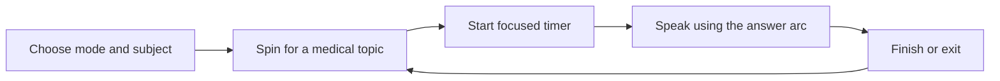
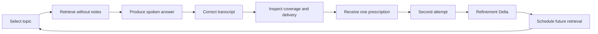
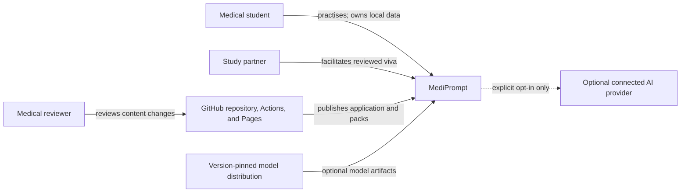

# L1 — Product and system context

**Status:** Proposed for v0.1 review
**Scope:** Product intent, users, outcomes, boundaries, and external context
**Audience:** Owner, medical reviewers, contributors, designers, and engineers

## 1. Executive view

MediPrompt is a medical speaking-practice application designed to close the gap between
recognizing information and producing a clear spoken answer. It gives a learner a topic, limits
research and answer time when selected, records or times the answer, separates content coverage
from delivery observations, prescribes one improvement, and asks for a second attempt. Weak topics
return later.

The zero-cost product is a browser-local PWA with no mandatory account or server. Reviewed medical
content lives in versioned topic packs. Java/Spring Boot supports content compilation first and an
optional connected platform later.

MediPrompt is not positioned as a novel AI category. Its first product is deliberately an
Unprompted-format medical speaking tool: choose mode and subject, spin for a medical topic, then
speak against a focused timer and short answer arc. Products already generate viva questions,
transcribe speech, and coach delivery. MediPrompt's later promise is a better learning loop:
transparent rubrics, privacy, useful failure behavior, and evidence that practice improves the
next attempt.

## 2. Problem statement

Medical study tools primarily help learners consume information or recognize correct answers.
Vivas, OSCEs, seminars, ward rounds, and case presentations require a different performance:
retrieving knowledge without cues, structuring it, selecting relevant facts, explaining mechanisms,
and responding to follow-up questions under time pressure.

This creates four common states:

| Knowledge | Spoken performance | Learner need |
| --- | --- | --- |
| Strong | Strong | Maintain and transfer to harder questions |
| Strong | Weak | Structure, retrieve, and practise delivery |
| Weak | Fluent | Detect missing or unsupported medical content |
| Weak | Weak | Return to source learning before further performance practice |

Generic speech coaches address delivery but do not understand medical answer structures. Question
banks and flashcards address recall but rarely require coherent speech. Generic AI tutors can bridge
the interface but may give opaque, inconsistent, or ungrounded feedback and introduce recurring
costs. MediPrompt combines reviewed medical rubrics with observable speech metrics and makes each
feedback statement inspectable.

## 3. Product vision

> Make high-quality spoken medical retrieval practice as easy to start as drawing a prompt.

The learner should be able to open the application on a phone and begin within five seconds. The
experience should feel calm rather than exam-like until the learner chooses a viva-pressure mode.
The system should reveal complexity only after the attempt, when feedback is actionable.

## 4. Goals

### G1 — Lower the activation cost

- No account, onboarding flow, or model download before the first topic.
- One dominant action on every practice state.
- Phone-first use with accessible desktop behavior.

### G2 — Practise the target performance

- Require spoken retrieval rather than recognition.
- Support answer structures appropriate to diseases, drugs, anatomy, physiology, procedures, and
  clinical cases.
- Add progressive follow-up questions and audience/register changes.

### G3 — Make feedback useful and accountable

- Keep content coverage and delivery observations separate.
- Trace local content feedback to reviewed rubric concepts and transcript evidence.
- Let the learner correct transcription before evaluation.
- Give one next action and encourage an immediate retry.

### G4 — Protect the learner

- Local processing and local storage by default.
- No emotion, confidence, personality, intelligence, honesty, or accent grading.
- No identifiable patient information.
- Explicit deletion, export, limitation, and consent behavior.

### G5 — Create a credible open project

- Versioned, source-aware topic packs with automated validation and human review.
- Reproducible device, transcription, and scoring evaluation.
- Clear architecture evolution from static PWA to optional Spring Boot capabilities.
- Honest evidence proportional to the study design.

## 5. Non-goals

- Diagnosis, treatment recommendations, patient triage, or clinical decision support.
- Official examination, certification, ranking, or academic grading.
- Replacement for faculty feedback or supervised clinical education.
- Emotion recognition, lie detection, confidence inference, or accent modification.
- Always-on microphone monitoring, voice identity, or biometric recognition.
- Redistribution of textbook prose, proprietary question banks, or source ordering.
- A generic notes, MCQ, flashcard, or learning-management platform.
- A mandatory cloud account or mandatory generative AI model.
- Institutional deployment before privacy, security, accessibility, and legal review.

## 6. Users and jobs to be done

### P1 — Time-pressured medical student

**Context:** Exams are approaching; notes feel familiar, but spoken answers are hesitant or
unstructured.
**Job:** “When I revise a topic, help me discover whether I can explain it without cues and tell me
the one thing that will make my next answer better.”
**Success:** Completes short daily sessions and improves the second attempt without needing a tutor.

### P2 — Clinically knowledgeable but presentation-anxious learner

**Context:** Knows facts but loses structure under time pressure.
**Job:** “Help me practise answer-first organization, deliberate pauses, and follow-up defence in a
private setting.”
**Success:** Uses observable delivery feedback without being judged by accent or inferred emotion.

### P3 — Study partner

**Context:** Wants to conduct peer vivas consistently.
**Job:** “Give me reviewed follow-up questions and a rubric so I can examine my friend without
inventing the session.”
**Success:** Can run a session and give evidence-based peer feedback.

### P4 — Medical educator/content reviewer

**Context:** Wants learners to practise an accepted syllabus and answer structure.
**Job:** “Let me review concepts, synonyms, common errors, sources, and follow-ups before students
use them.”
**Success:** Can audit and version content without reviewing application code.

### P5 — Open-source topic-pack contributor

**Context:** Wants to add a subject, university, or exam pack.
**Job:** “Give me a schema, validator, examples, and review rules so my content is safe to merge.”
**Success:** A pull request fails fast on malformed or unsourced content and is readable by a
medical reviewer.

## 7. Core user journeys

### UJ1 — First practice in under five seconds

1. Learner opens the PWA.
2. Recall Sprint and a default medical subject are already selected and can be changed.
3. The topic stage is ready, and **Start timer** is disabled.
4. Learner presses **Spin** and sees a brief drawing state followed by one medical topic.
5. **Spin again** and **Start timer** become available.
6. Learner starts a focused speaking view showing the topic, three-part answer arc, large circular
   countdown, current instruction, and close/end action.
7. At completion or close, the learner returns and can spin again. Enhanced review appears only
   when its later capability is available and enabled.

The first journey must not depend on audio, a model, an account, or a network after the shell and
pack are loaded.

### UJ2 — Private recorded attempt

1. Learner enables private speech analysis.
2. App explains microphone and local-processing behavior before requesting permission.
3. App records and locally analyses the answer.
4. Local transcription runs in a worker.
5. Learner corrects the transcript.
6. Delivery observations are shown separately from later content coverage.

### UJ3 — Refine immediately

1. App maps the corrected transcript to rubric concepts.
2. Learner sees covered, possibly covered, and not found concepts with transcript evidence.
3. App selects one improvement prescription.
4. Learner retries the same prompt.
5. App reports the Refinement Delta and changed delivery observations.

### UJ4 — Viva Round

1. Learner answers a primary prompt.
2. App or study partner presents a reviewed Recall question.
3. The sequence progresses through Explain, Apply, Differentiate, and Defend as appropriate.
4. Each response remains separately reviewable; the system does not synthesize an official grade.

### UJ5 — Exam countdown

1. Learner chooses an exam date and subjects.
2. App builds a bounded daily queue.
3. Due topics mix weak, new, and previously strong material.
4. Learner self-rates recall after each attempt.
5. The schedule changes deterministically and explains why a topic returns.

### UJ6 — Build a syllabus pack

1. Owner runs the local Java content compiler against an authorized PDF.
2. Tool extracts candidate topic names, drops source ordering, normalizes duplicates, and proposes
   a hierarchy.
3. Human reviews the draft and writes original rubrics, synonyms, common errors, and sources.
4. Validator produces runtime JSON and a provenance manifest.
5. Pull request receives automated and medical-content review.

## 8. Learning loop

The permanent basic loop is intentionally smaller than the extended coaching loop:

When optional review capabilities are enabled, the same attempt can continue through:

The loop applies retrieval practice, production aligned to the target assessment, immediate
feedback, deliberate repetition, and distributed practice. The system should not overwhelm the
learner with every possible metric. It should select feedback that can change the next attempt.

## 9. Practice modes

### Recall Sprint

- Default mode.
- No enforced preparation timer.
- 60–90 seconds answer.
- One prompt and one prescription.
- Suitable for daily retrieval and first-run use.

### Viva Round

- Configurable preparation and answer time.
- Primary prompt plus reviewed progressive follow-ups.
- Question ladder is metadata, not generated by default.
- Study-partner mode can hand control to a peer.

### Deep Research

- Configurable research countdown with an explicit **Done researching** action.
- Separate ready-to-speak confirmation before the speech countdown starts.
- Shows only reviewed/linked sources.
- The learner speaks after research; the system compares against the same transparent rubric.
- No unrestricted web search in the scoring path.

### Teach-back

- Examiner: concise, technical, prioritized.
- Junior: structured explanation with mechanisms and definitions.
- Patient: plain language, empathy, and avoidance of jargon.
- Each register uses a separately reviewed rubric; rewriting vocabulary alone is insufficient.

## 10. Experience and visual direction

The interaction reference establishes a required behavioral baseline—not reusable code, content,
copy, brand, or pixel-identical layout. MediPrompt preserves the compact interaction and gives it a
distinct medical learning identity. Privacy choices, evidence, and retry appear only as progressive
enhancements around the basic tool.

### Screen structure

- **Ready:** compact mode switch and medical-subject selector, neutral topic stage, dominant
  **Spin** action, disabled timer action, and quiet settings access.
- **Topic drawn:** replace the neutral state with “Your topic,” the medical topic, **Spin again**,
  and the now-enabled **Start timer** action.
- **Research:** Deep Research alone uses a focused research countdown, allows early completion, and
  presents an explicit ready-to-speak handoff.
- **Speak:** use a focused overlay/page with the topic, three-part medical answer arc, large circular
  countdown, current instruction, and close/end action. Recording is optional and explicit.
- **Review enhancement:** when available, show the corrected transcript, separate Content and
  Delivery sections, one prescription, and a dominant **Try again** action after the basic attempt.

Secondary controls—subject, history, settings, data controls, and pack sources—stay reachable but
do not compete with the current action. On small screens the flow is one column. Wider screens may
place evidence beside the transcript only when reading order and focus order remain correct.
Settings expose speech and research duration without turning the main surface into a form.

### Visual language

- Warm ivory background rather than clinical white.
- Deep teal for primary actions and headings, terracotta for restrained emphasis, and sage for
  calm success/evidence states; error meaning uses a separate accessible treatment.
- Newsreader for short editorial headings and Inter for controls, body copy, timers, and data.
- Generous whitespace, quiet borders, and little decorative chrome; no dashboard of invented
  scores, gradients, gamified streak pressure, or medical imagery used as decoration.
- Color combinations must meet WCAG 2.2 AA contrast, and all meaning must also appear in text,
  labels, or shape.

The medical answer arc defaults to **Define → Explain → Apply** and may be overridden by a reviewed
topic blueprint (for example, a procedure or drug answer structure). It guides speech; it does not
expose the hidden rubric or turn the timer into a form.

The shipped fonts must be subset/self-hosted or use metric-compatible fallbacks so the first prompt
does not depend on a third-party font request. The design system defines tokens rather than copying
fixed colors from the reference site. v0.2 includes responsive states at 320px, common phone sizes,
tablet, and desktop before detailed polish.

## 11. System context

## 12. Product principles

1. **Attempt before feedback.** Do not expose the rubric before retrieval unless the selected mode
   explicitly permits research.
2. **Local before connected.** Network AI is an enhancement, not the product's foundation.
3. **Evidence before score.** Show which transcript phrase or metric caused feedback.
4. **Coverage is not correctness.** Never promote semantic similarity into a medical truth claim.
5. **One next action.** Rank feedback and prescribe the most useful change.
6. **Retry while context is fresh.** The second attempt is a primary feature, not a button buried in
   history.
7. **Difficulty is desirable.** Retrieval can feel harder than rereading; explain this without
   turning the app into punitive gamification.
8. **No accent ideal.** Optimize intelligibility and learner control, not conformity.
9. **Failure must be honest.** Unsupported device, uncertain transcript, or missing rubric produces
   a visible fallback—not fabricated output.
10. **Content is code with human accountability.** Version, validate, review, and cite it.

## 13. Success measures

### Product/learning-loop measures

- Median landing-to-topic time below five seconds after the shell is cached.
- At least 70% of started attempts reach completion during the target-user beta.
- At least 40% of reviewed attempts lead to an immediate retry during refinement testing.
- Learner rates the single prescription useful in at least 4 of 5 sampled sessions.
- Due-topic queue is completed on at least three days per week during the beta; this is descriptive,
  not a coercive streak target.

### Technical measures

- No main-thread long task above the agreed performance budget during normal UI transitions.
- Model download, initialization, cancellation, and failure states are observable.
- No raw audio network request in local mode.
- Deterministic metrics match golden fixtures within documented tolerances.
- Coverage matches and non-matches are reproducible for a pinned model and threshold.
- All local data is exportable and deletable.

### Evidence measures

- Transcription correction rate is reported by term category and device configuration.
- Coverage engine is compared with blinded human rubric decisions before broad claims.
- Educator agreement work reports confidence intervals and subgroup limitations.
- “Effectiveness” is not claimed from engagement or second-attempt improvement alone.

## 14. Assumptions and validation plan

| Assumption | Current status | Validation |
| --- | --- | --- |
| Students experience a knowledge-to-speech gap | Strong rationale; local user not yet studied | Structured interview and baseline attempts |
| Single-screen practice lowers friction | Supported by reference pattern; not tested here | First-run usability timing |
| Local `whisper-base.en` is usable on target phones | Open | Device benchmark with representative speech |
| Transcript correction is acceptable effort | Open | Measure correction time and abandonment |
| MiniLM coverage feedback is useful | Open | Golden fixtures and student/educator review |
| One prescription improves the next attempt | Open | Refinement Delta plus qualitative feedback |
| Learner wants spaced resurfacing | Open | Beta behavior/interview |
| Three packs are enough for v1.0 | Provisional | Match initial exam scope |

## 15. Safety and regulatory boundary

- Voice recordings and transcripts are personal data. Local mode avoids transfer; connected mode
  requires purpose, consent, retention, access, deletion, and incident-response controls.
- The application prohibits real patient identifiers in prompts, recordings, transcripts, and PDF
  ingestion.
- No biometric identification or voiceprint is created.
- Emotion inference is out of scope by product policy and must remain out of institutional variants.
- Users under the applicable digital-consent age require a jurisdiction-specific design and legal
  review; v1.0 targets adult learners unless explicitly changed.
- The application shows an educational-use disclaimer and does not present a passing score.
- A legal review is required before institutional procurement, minor use, or connected processing
  in a new jurisdiction. This document is not legal advice.

## 16. Key terms

- **Rubric concept:** a reviewed idea expected in an answer, with accepted synonyms and evidence.
- **Coverage:** evidence that the transcript expresses a rubric concept; not proof of correctness.
- **Delivery observation:** a reproducible property of the recording or transcript.
- **Prescription:** the single prioritized change recommended for the next attempt.
- **Refinement Delta:** attempt-two coverage minus attempt-one coverage for the same prompt/rubric.
- **Topic pack:** versioned subject content containing prompts, rubrics, follow-ups, and sources.
- **Local mode:** no learner content leaves the device.
- **Connected mode:** explicitly enabled server/provider processing under documented controls.

## 17. References informing the design

- [Unprompted](https://www.unprompted.cool/) — required behavioral baseline; no code, content,
  copy, brand, or pixel-identical design reuse.
- [The Use of Retrieval Practice in the Health Professions](https://pmc.ncbi.nlm.nih.gov/articles/PMC12292765/)
- [Transformers.js](https://github.com/huggingface/transformers.js)
- [WebLLM](https://github.com/mlc-ai/web-llm)
- [EU summary of rules for trustworthy artificial intelligence](https://eur-lex.europa.eu/EN/legal-content/summary/rules-for-trustworthy-artificial-intelligence-in-the-eu.html)
