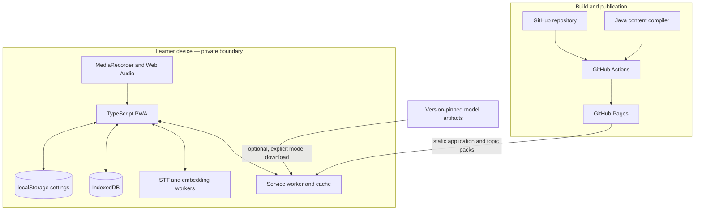
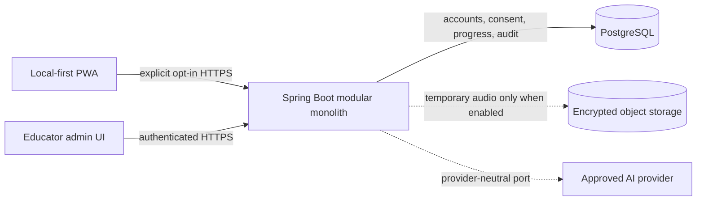

# L2 — Container architecture

**Status:** Accepted v0.1 baseline
**Scope:** Runtime containers, deployment, trust boundaries, and technology choices
**Audience:** Engineers, security reviewers, content maintainers, and operators

## 1. Architecture summary

MediPrompt begins as two independently useful systems:

1. A static, offline-capable learner PWA that runs practice, audio analysis, transcription,
   rubric coverage, retry comparison, and scheduling in the browser.
2. A Java 21/Spring Boot command-line content compiler that turns human-reviewed source packs into
   deterministic runtime assets.

The public learning loop therefore has no always-on backend, database, account, or mandatory AI
bill. A connected Spring Boot modular monolith may be added after v1.0 for opt-in synchronization,
educator workflows, and provider-backed coaching. Local guest mode remains a complete product.

The PWA is layered around a permanent **basic practice core**: mode and subject selection, topic
draw, focused countdown, answer arc, finish/exit, and spin again. Recording, workers, IndexedDB,
feedback, scheduling, and connected services are adapters or progressive enhancements. Failure or
absence of any enhancement cannot disable the basic core.

## 2. Zero-cost local deployment

### Containers

| Container | Responsibility | Data held | Versions |
| --- | --- | --- | --- |
| Basic practice core | Mode/subject selection, topic draw, focused timer, answer arc, finish and repeat | In-memory current topic/timer | v0.2+ |
| Learner enhancements | Recording, review, retry, scheduling and history UI | In-memory active session | v0.3+ |
| Browser workers | Transcription and semantic coverage off the main thread | Temporary audio/features/model state | v0.3–v0.4+ |
| localStorage | Accessibility and timer settings | Learner-owned settings | v0.2+ |
| IndexedDB | Attempts, pack metadata, model metadata, due queue | Learner-owned local data | v0.5+ |
| Service worker/cache | Offline shell, content and optional pinned model assets | Public immutable assets | v0.2+ |
| Topic packs | Prompts, reviewed rubrics, follow-ups and source metadata | No learner data | v0.2+ |
| Content compiler | PDF candidate extraction, validation and deterministic compilation | Authorized source input and review drafts | v0.6+ |
| GitHub Actions/Pages | Validation, static build and publication | Public build artifacts | v0.2+ |

Model files should be fetched only after the learner enables speech or coverage intelligence. The
first prompt must not wait for a model download. Cached application and pack versions must continue
to work if the network disappears.

## 3. Optional connected deployment

Dashed paths are optional even in connected mode. The server is a modular monolith until scaling
evidence justifies separation. It uses PostgreSQL and Flyway; `pgvector` is deferred until a
retrieval evaluation demonstrates that relational search and curated identifiers are insufficient.

## 4. Trust boundaries and audio lifecycle

### Local mode

1. The browser requests microphone access only after a plain-language explanation and learner
   action.
2. `MediaRecorder` creates an attempt-local blob. Web Audio derives observable measurements.
3. A worker transcribes locally. The learner may play the audio and correct the transcript.
4. Coverage and delivery feedback use the corrected transcript and local measurements.
5. Raw audio is discarded when the attempt ends by default. A future “save recording locally”
   option must be explicit and reversible.
6. Only the learner-selected attempt summary is persisted. No analytics SDK receives transcript,
   audio, rubric response, or voice-derived features.

The service worker, model host, and GitHub Pages serve public immutable files. They must never be
sent learner content through query strings, telemetry, error reports, or cache keys.

### Connected mode

Connected processing requires a second, explicit consent boundary. Audio/transcript upload is
purpose-specific rather than implied by signing in. Server logs exclude bodies and signed URLs.
Raw audio is deleted after processing by default, and retention jobs are testable and auditable.
Provider credentials remain server-side; users are never asked to paste a personal ChatGPT token
into browser storage. A self-hosted operator may configure a provider key through secret
management.

### Prohibited data

- Identifiable patient information in packs, prompts, recordings, transcripts, fixtures, logs, or
  analytics.
- Voiceprints, speaker identity, emotion inference, accent ranking, or personality inference.
- Provider prompts containing more learner data than is necessary for the selected operation.

## 5. Topic-pack publication flow

```mermaid
flowchart LR
    PDF[Authorized syllabus PDF] --> Extract[Extract candidate labels and coordinates]
    Extract --> Normalize[Normalize without losing evidence]
    Normalize --> Draft[Draft YAML]
    Draft --> Review[Human source, medical, challenge and licence review]
    Review --> Validate[Schema and policy validation]
    Validate --> Compile[Deterministic runtime JSON]
    Compile --> Manifest[Checksums and provenance manifest]
    Manifest --> PR[Reviewed pull request]
    PR --> Pages[Versioned static assets]
```

PDF extraction discovers candidate labels and preserves page/curriculum coordinates; it does not
generate medical truth. Unneeded source prose and any patient material are rejected or removed
unless lawful use and product need are explicit. Reviewers author original prompts, fictional cases,
difficulty variants, rubrics, and citations. Publication requires machine validation and human
approval.

## 6. Deployment and CI

### PWA pipeline

1. Install with a pinned Node LTS version and lockfile.
2. Lint, type-check, unit-test, component-test, validate packs, and build.
3. Run accessibility smoke checks and production bundle/model-manifest budget checks.
4. Upload a GitHub Pages artifact only from protected, reviewed branches.
5. Deploy immutable hashed assets; keep the app entry and pack index short-lived.
6. Run a post-deploy smoke test against a clean browser profile.

Pull requests get preview build artifacts, not a second permanent hosting stack. Production Pages
deployment begins with v1.0; pre-release builds may be downloaded or enabled temporarily for the
target-user test.

### Compiler pipeline

The compiler runs locally and in CI. Golden PDFs contain synthetic/non-clinical fixtures. CI checks
that the same reviewed YAML produces byte-stable runtime JSON and manifest checksums across builds.

### Future server pipeline

The connected service builds a reproducible container image, runs unit/integration/contract and
dependency scans, applies Flyway migrations through a controlled release, and separates staging
from production secrets. Its deployment target remains undecided until v1.1 planning.

## 7. Technology decisions

| Area | Initial choice | Reason | Revisit trigger |
| --- | --- | --- | --- |
| Learner app | TypeScript PWA | Browser reach, static hosting, worker ecosystem | Only if device evidence disproves viability |
| Static host | GitHub Pages | No recurring infrastructure cost | Availability, policy, or scale limitation |
| Recording | MediaRecorder + Web Audio | Native browser primitives | Unsupported target browser |
| Local STT | Transformers.js + candidate `whisper-base.en` | Local privacy and acceptable candidate quality | v0.3 device benchmark |
| Coverage | Quantized `all-MiniLM-L6-v2` + reviewed rubric | Inspectable semantic coverage | Human disagreement or device budget |
| Local storage | IndexedDB | Structured, asynchronous, offline | Data-volume or compatibility evidence |
| Content authoring | Versioned YAML | Reviewable diffs | Reviewer usability evidence |
| Content runtime | Validated JSON | Fast deterministic browser consumption | None expected |
| Compiler | Java 21 + Spring Boot CLI + PDFBox | Java portfolio depth and safe content pipeline | Extraction quality or runtime burden |
| Connected server | Spring Boot modular monolith | Simple operational boundary and evolution path | Proven scaling/team boundary |
| Connected database | PostgreSQL + Flyway | Mature relational/audit model | Measured retrieval need for vectors |

Web Speech API may be exposed as a labelled convenience when on-device recognition is verifiably
available, but it is not a contractual fallback. Typed/corrected transcript and local-model paths
remain supported.

## 8. Quality attributes

### Performance

- Meaningful first render from cached shell in under 2 seconds on the target mid-range phone.
- First topic available in under 5 seconds without model initialization.
- Audio/STT/embedding work off the main thread; UI remains cancellable.
- JavaScript application bundle and pack budgets are enforced separately from opt-in model files.

### Reliability and offline behavior

- Timers derive remaining time from monotonic timestamps rather than interval counts.
- Active sessions recover from visibility changes without extending research or speaking time.
- Atomic IndexedDB transactions and versioned migrations protect progress.
- A failed model load degrades to recording/playback, typed transcript, or self-review.
- An old valid pack remains usable until a new pack is fully downloaded and validated.

### Accessibility

- WCAG 2.2 AA target, semantic HTML, visible focus, full keyboard control, and reduced motion.
- Timer changes are visual by default; announcements occur at meaningful thresholds, not every
  second.
- Feedback never relies only on color, waveform shape, or audio playback.
- Touch targets and text remain usable at 320 CSS pixels and 200% zoom.

### Security and privacy

- Strict CSP, dependency pinning, Subresource Integrity where applicable, and no inline secrets.
- Pack and model manifests use version, expected size, and checksum before activation.
- Export/delete workflows are tested like product features.
- Connected-mode authorization is deny-by-default with object-level access checks and audited
  administrative changes.

### Medical-content integrity

- Every rubric concept has reviewer/source metadata and a pack version.
- Feedback is traceable to rubric evidence or explicitly `NOT_VERIFIABLE`.
- Local semantic similarity is never described as a diagnosis, grade, or correctness proof.

## 9. Evolution guardrails

1. No connected feature may remove or materially weaken local guest mode.
2. No model output becomes medical ground truth without reviewed source/rubric evidence.
3. No provider SDK is called directly from the browser with a reusable secret.
4. No microservice is introduced without an independently measurable scaling, ownership, or
   isolation need.
5. No vector database is introduced without a retrieval benchmark.
6. No learner audio is retained by default.
7. No “engagement,” second-attempt gain, or small calibration result is marketed as efficacy.

## 10. Open L2 decisions

- Exact Node/build framework after a v0.2 spike; Vite is the leading lightweight option.
- Approved model artifact host, licence, checksum, and caching constraints.
- Browser/device support matrix based on the target learner's hardware.
- Content and software licences before public contributions.
- Future connected hosting region and provider only when v1.1 is authorized.
