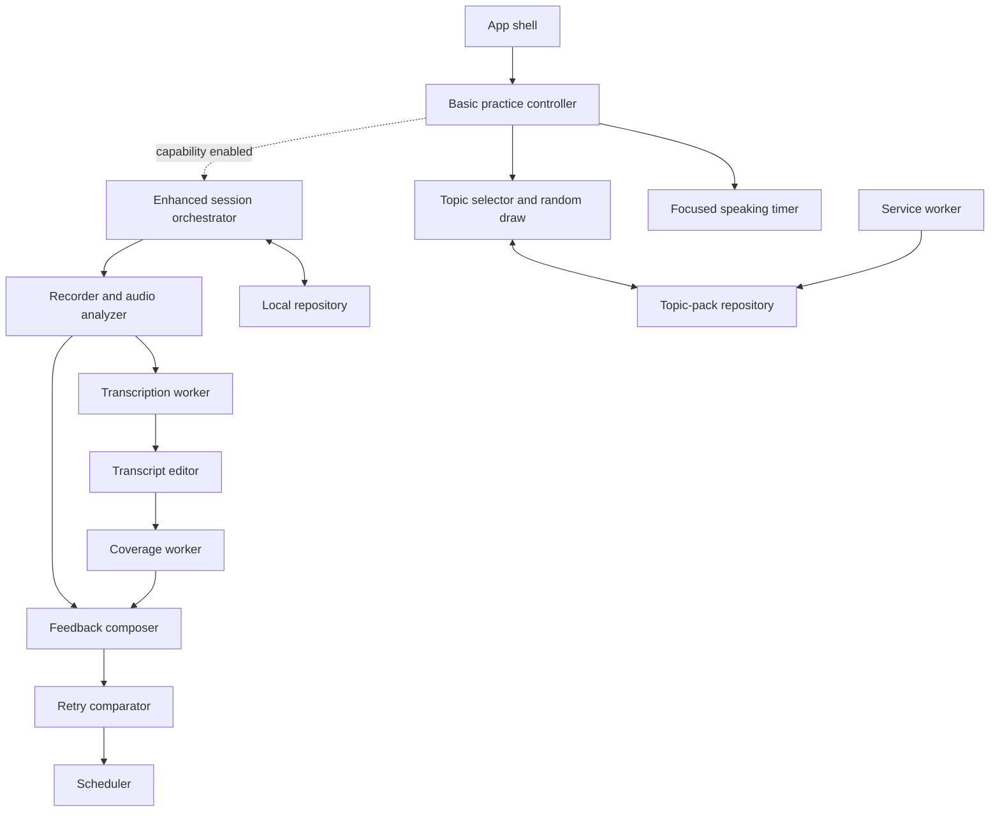
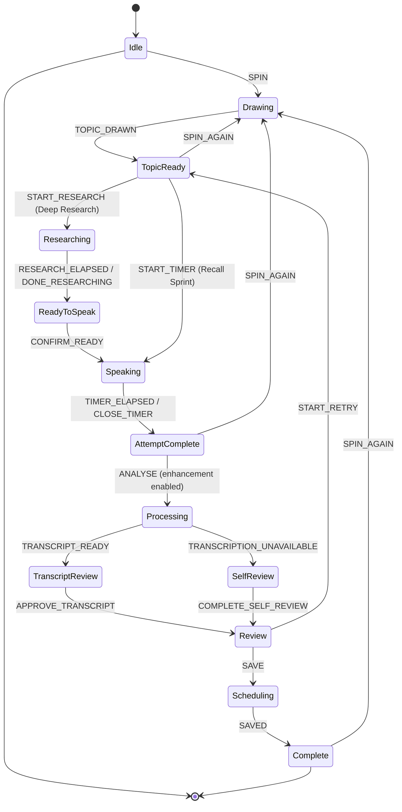
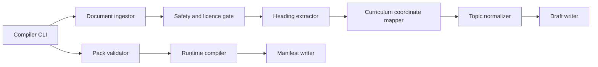

# L3 — Component design

**Status:** Accepted v0.1 baseline
**Scope:** Application components, state, storage, topic packs, and service boundaries
**Audience:** Implementers and reviewers

## 1. Learner PWA components



### App shell

Owns routing, the one-screen responsive frame, install/update state, accessibility announcements,
error boundary, and capability detection. It does not implement learning rules. The primary route
restores or starts one practice session; settings, history, data controls, and pack information are
secondary routes or sheets.

### Basic practice controller

This is the non-negotiable product core. It owns mode and subject selection, `Spin`, drawing state,
topic readiness, `Spin again`, timer entry, the medical answer arc, finish/exit, and repeat. It uses
only bundled topic data and the clock. It must run when microphone, workers, IndexedDB, network, and
all review capabilities are missing or disabled.

### Practice session orchestrator

Progressively wraps the basic controller when enhanced attempts are enabled. It coordinates
recording, transcription, correction, review, retry, and save without changing the base
mode/subject → spin → timer contract. Side effects are exposed through ports so reducer transitions
stay deterministic and testable.

### Topic selector and random draw

Filters enabled topic variants by subject, practice mode, challenge preset, register, and due state.
Random draw uses a shuffled bag per full filter fingerprint: each eligible variant appears once
before reshuffle. A recent-topic exclusion prevents immediate repeats across bag resets. Scheduling
may override random selection only when the learner chooses the due queue. When only one challenge
is available, the selector hides the challenge control rather than showing unavailable choices.

### Timer service

Stores `startedAt`, `deadlineAt`, duration, pause policy, and last announced threshold. Remaining
time is derived from the current monotonic clock. `setInterval` only requests a render; it is never
the source of truth. Browser backgrounding cannot grant extra time. The basic timer surface always
shows the topic, a reviewed challenge-specific arc (`Define -> Explain -> Apply`, `Summarize ->
Reason -> Plan`, or `Prioritize -> Defend -> Safety-net`), a large circular countdown, current
instruction, and a close/end control. Accessibility time adjustments do not mutate challenge.

Deep Research first uses the same deadline engine in a research surface. The learner may select
**Done researching** before expiry; both early completion and expiry lead to a separate
ready-to-speak confirmation. The speech countdown begins only after that confirmation.

### Recorder and audio analyzer

Wraps microphone permission, `MediaRecorder`, playback URL lifetime, and Web Audio analysis. It
emits chunks and observable features rather than interpretations. Voice activity supplies speech
segments and silence intervals. Loudness stability and clipping are reported with device-aware
limitations; the component never labels emotion or confidence.

### Transcription worker

Lazy-loads a pinned local model after explicit activation. It supports progress, cancellation,
timeouts, low-memory errors, and deterministic model metadata. Audio and interim text remain in the
worker boundary until the result is returned. The result always records model/version and may carry
uncertain spans. An absent transcript is a valid failure outcome.

### Transcript editor

Shows the raw result, makes corrections explicit, and records only the final learner-approved text
for coverage. It can highlight low-confidence or glossary terms without auto-correcting medical
meaning. Editing never changes delivery metrics derived from audio.

### Coverage engine

Accepts approved transcript text and one versioned rubric. The v0.4 baseline normalizes a bounded
input, matches whole accepted-phrase token sequences or nearby significant tokens, and returns the
concept identifier plus matched accepted phrase. It rejects partial-word matches, does not combine
distant evidence, and returns an explicit unavailable reason when the transcript or scorable rubric
is absent. It does not invent missing content or claim correctness. A v0.5 worker may add calibrated
sentence embeddings and `possiblyCovered` evidence while retaining this deterministic fallback.

### Feedback composer

Combines content evidence and delivery observations using deterministic priority rules. It produces:

- a separate content-coverage section;
- a separate delivery-observations section;
- limitations and unverifiable outcomes; and
- exactly one prioritized prescription for the next attempt.

Templates are plain, inspectable copy. A future connected model may phrase an explanation, but it
must consume the same structured evidence and cannot override a failed/unknown result.

### Retry comparator

Compares two attempts for the same topic, prompt, rubric version, mode, and time policy. It reports
newly covered/lost concepts and metric changes. `coverage(attempt2) - coverage(attempt1)` is named
Refinement Delta. If comparison inputs differ, the comparator explains why a delta is unavailable.

### Scheduler

Maintains a bounded due queue using deterministic intervals of 1, 3, 7, and 14 days. Coverage and
learner self-rating select an interval; missed days move an item to due without compounding a
penalty. The scheduler explains the chosen next date and remains timezone-safe through local-date
semantics.

### Local repository

Provides typed, transaction-based access to IndexedDB. Domain services never call IndexedDB
directly. The repository handles schema migrations, import/export, delete-all, pack references,
and recovery from quota or corruption errors.

### Topic-pack repository

Loads the bundled demonstration pack first, verifies schema/version/checksum, and activates a newly
cached pack atomically. Session records retain the exact pack/rubric version so later content
updates do not rewrite history.

### Service worker

Uses cache-first for immutable hashed application/model assets, stale-while-revalidate for a pack
index, and network-first with a valid-cache fallback for the HTML entry. It never caches POST
requests or learner data. Updates wait until the session is safe to reload.

## 2. Session state machine



Permission denial, model failure, cancellation, and low memory are events, not exception-only
paths. They lead to recoverable states with recording/playback, typed transcript, or self-review
where safe. A fatal storage error still permits an unsaved session.

`Idle → Drawing → TopicReady → Speaking → AttemptComplete → Drawing` is the v0.2 Recall Sprint
path. Deep Research inserts `Researching → ReadyToSpeak` before `Speaking`. States after
`AttemptComplete` are optional extensions and must be removable without breaking either basic path.

## 3. Primary data flow

1. `TopicPackRepository` returns an immutable `TopicSnapshot`.
2. Orchestrator creates `PracticeSession` with mode, timers, capability choices, and versions.
3. Recorder emits an attempt-local `AudioHandle`; analyzer emits `DeliveryMetrics`.
4. Transcriber returns `TranscriptDraft`; learner produces `ApprovedTranscript`.
5. Coverage engine returns `CoverageEvidence` for the immutable rubric snapshot.
6. Feedback composer returns `Review` and one `Prescription`.
7. Retry repeats steps 2–6 with `attemptNumber = 2`.
8. Comparator creates `AttemptComparison`; scheduler creates `ScheduleDecision`.
9. Repository saves the serializable summary in one transaction; raw audio is revoked/discarded.

## 4. Topic-pack domain

A source pack is review-oriented YAML; runtime packs are compiled JSON. The conceptual hierarchy is:

```text
TopicPack
 ├─ identity: schemaVersion, contentKind, packId, version, title, locale, licence
 ├─ provenance: maintainers, reviewers, sources, reviewedAt
 └─ subjects[]
     └─ topics[]
         ├─ identity: topicId, title, tags
         ├─ curriculum: program, year, track, paper, module, competencyCodes, sourceLocators
         ├─ classification: primaryDomain, contexts[], promptBlueprints[]
         ├─ variants[]: variantId, mode, challengePreset, difficultyProfileVersion, blueprint,
         │              supportLevel, wording, answerArc, timePolicy, caseRef, followUpRefs
         ├─ rubrics[]: rubricId, variantId, register, concepts[], reasoning/safety criteria
         │   └─ concept: conceptId, label, accepted phrases, importance, sourceRefs
         ├─ vivaQuestions[]: stage, wording, rubricId
         ├─ commonErrors[]: reviewed wording and sourceRefs
         └─ contraindications/limitations metadata when applicable
```

Rules:

- Identifiers are stable, lowercase, and pack-scoped; display titles may change.
- `contentKind` distinguishes medical material from an explicitly non-medical interaction fixture.
  An `APPROVED` medical pack requires a `MEDICAL_REVIEWER`; a content editor cannot promote
  medical claims. A learner-visible `DRAFT` is a practice beta, never an approval state.
- `DRAFT` review candidates carry an empty `reviewers` array and `reviewedAt: null`. This is valid
  authoring state, not malformed approval. `APPROVED` still requires at least one reviewer and a
  real ISO review date; the medical production gate additionally requires `MEDICAL_REVIEWER`.
- Curriculum coordinates preserve source navigation and are never inferred from display order.
- Classification is orthogonal to curriculum coordinates: it supports discovery but never replaces
  year, track, paper, module, competency code, or page evidence.
- Every medical assertion or expected concept links to a pack source entry.
- Accepted phrases are curated equivalents, not model-generated at runtime.
- Common errors are optional and never shown as if detected unless transcript evidence supports it.
- Mode, challenge, and register are independent; every medical-release combination points to a
  reviewed variant-specific rubric. Public-beta rubrics remain explicitly unreviewed.
- `GUIDED`, `APPLIED`, and `VIVA` are versioned difficulty vectors. A scalar difficulty label is not
  sufficient authoring metadata.
- Applied variants require a bounded fictional case. Viva variants additionally require plausible
  alternatives and a reviewed follow-up/evidence update. Real patient details are prohibited.
- Additional time and visible rescue scaffolds are accessibility/support choices, not lower
  challenge levels.
- A breaking semantic change increments the pack major version; history keeps its snapshot reference.
- Published packs contain original wording and licence metadata, not copied textbook prose.

Extracted curriculum inventories are a separate authoring input, not a weak form of `TopicPack`.
Each candidate moves through `candidate -> normalized -> prompt-ready-beta -> educator-reviewed ->
published`. Only the last state may be compiled into an approved medical release pack. A
source-grounded `prompt-ready-beta` snapshot may run only through the explicit public-draft gate,
with empty attestation and a persistent non-clinical warning. Earlier incomplete states remain
invalid learner content.

The first source-grounded candidate is stored in `content/candidates/`, not `content/packs/`.
Candidate validation applies the runtime schema and demo depth minimums, then asserts that the
medical release gate fails. Build copying allowlists that exact 20-topic candidate for the public
practice beta and rejects the generic regression fixture from the learner artifact.

The recommended primary-domain taxonomy is foundations/science, condition/pathophysiology,
assessment/investigation, clinical reasoning, intervention/rehabilitation,
procedure/perioperative/critical care, population/community/participation,
research/ethics/evidence/professional practice, and sport/performance. Context tags such as age
group, population, body region, and system are multi-valued secondary facets.

## 5. Local persistence and migrations

Settings use `localStorage` from v0.2 because they are small and synchronous, with in-memory
defaults when storage is unavailable. The value is a versioned, schema-validated JSON object;
invalid or newer unsupported data falls back safely instead of blocking practice. IndexedDB is
introduced at v0.6 for the learning-record and metadata stores below.

| Store | Key | Purpose | Sensitive content |
| --- | --- | --- | --- |
| `packMetadata` | pack id + version | Checksums, activation and provenance | None |
| `sessions` | session UUID | Mode/topic/version and completion metadata | Learning record |
| `attempts` | attempt UUID | Approved transcript, metrics, evidence, prescription | Personal data |
| `schedule` | topic identity | Due date, interval and self-rating | Learning record |
| `modelMetadata` | model id + version | Cache/readiness/benchmark information | None |

Raw audio is not a normal store. If local recording retention is later added, it requires a
separate opt-in store, visible storage use, individual deletion, and migration policy.

Migrations are forward-only, idempotent, fixture-tested, and transaction-scoped. Before a risky
migration the app offers export. Unknown newer schemas open read-only rather than overwriting data.
Delete-all removes the settings key from `localStorage`, IndexedDB data, caches that can identify
user choices, and any retained local recordings while preserving only public application assets
needed to show confirmation.

## 6. Java content compiler components



- **Compiler CLI:** explicit `extract`, `validate`, and `compile` commands; non-zero failure codes.
- **Document ingestor:** PDFBox text/page metadata adapter with encrypted/scanned/empty detection.
- **Safety and licence gate:** detects likely patient identifiers and rejects unsupported or
  unauthorized input; false positives require an explicit reviewed override outside CI.
- **Heading extractor:** proposes headings with page references and confidence, never medical
  rubrics.
- **Curriculum coordinate mapper:** preserves program/year/track/paper/module, exact competency
  code candidates, one-based PDF page locators, and source anomalies. Ambiguous row associations
  remain unresolved review items instead of being guessed.
- **Topic normalizer:** Unicode/case/punctuation normalization, conservative duplicate grouping,
  hierarchy and classification suggestions while retaining source evidence. Suggestions never
  advance lifecycle state.
- **Draft writer:** emits reviewable YAML with `DRAFT` status and unresolved fields.
- **Pack validator:** JSON Schema plus policy checks for sources, licences, stable IDs, reviewers,
  dangling refs, duplicates, and prohibited content.
- **Runtime compiler:** sorts deterministically and strips author-only notes while preserving
  provenance required by the learner.
- **Manifest writer:** records compiler version, input/output checksums, pack identity, and time in
  a reproducible form (timestamps supplied or omitted for byte stability).

## 7. Future connected modules

The Spring Boot service is organized by domain, not controller/service/repository layers spanning
the whole system:

- `identity`: account, session, role and deletion lifecycle;
- `consent`: versioned purposes and withdrawal;
- `progress`: opt-in synchronization and conflict resolution;
- `content`: pack/reviewer workflow and publication records;
- `coaching`: grounded feedback orchestration;
- `speech`: provider-neutral transcription operations;
- `governance`: quotas, audit events, retention and export;
- `admin`: server-rendered Thymeleaf/HTMX reviewer experience.

Each module exposes application ports. Provider, database, HTTP, object storage, and clock code are
adapters. Modules communicate through typed application calls/domain events within the monolith;
there is no internal HTTP. Provider outputs use strict schemas and are rejected if evidence or
required uncertainty fields are missing.

## 8. Error and fallback matrix

| Failure | Learner-visible behavior | Data behavior |
| --- | --- | --- |
| Microphone denied | Continue with timer and self/typed review; link to retry permission | No audio created |
| Unsupported codec | Offer timer-only path and supported-browser guidance | No partial blob retained |
| Model download offline | Continue without transcription; allow retry when online | Valid cached model unchanged |
| Model low memory/timeout | Cancel cleanly; typed transcript or playback remains available | Worker state released |
| Uncertain transcript | Highlight for correction; do not score until approved | Raw and approved text distinguished in memory |
| Coverage unavailable | Delivery/self-review still works; show `NOT_VERIFIABLE` | No fabricated coverage |
| Pack update invalid | Continue previous valid pack | Invalid pack never activated |
| IndexedDB quota/corruption | Continue current session unsaved; offer export/recovery | No silent overwrite |
| Connected provider failure | Fall back to local review or retry later | Idempotency prevents duplicate operation |

## 9. Component-level test responsibilities

- Pure domain services: property and golden-fixture tests.
- State reducer: every allowed/forbidden transition and recovery event.
- Audio: synthetic PCM fixtures for VAD, pause, clipping, and loudness calculations.
- Workers: protocol, cancellation, stale-response, memory failure, and pinned-version tests.
- Coverage: educator-labelled positive, ambiguous, negated, and irrelevant transcript fixtures.
- Challenge: educator-ordered prompt trios, vector/preset validation, scaffold independence,
  evidence-update paths, and rejection of timer-only fake escalation.
- Repository: real IndexedDB adapter tests, migrations, quota errors, export/import and delete-all.
- Service worker: offline shell, update activation, old-pack fallback and cache isolation.
- Compiler: synthetic golden PDFs, deterministic output, policy rejection and schema compatibility.
- Connected modules: port contract, authorization, consent, retention and provider-schema tests.

## 10. L3 decisions deferred to implementation spikes

- Exact VAD algorithm and thresholds after representative audio fixtures exist.
- Sentence segmentation behavior for abbreviations and medical units.
- Embedding quantization/threshold per device and rubric dataset.
- Cross-device synchronization conflict policy before v1.1.
- Whether saved local recordings provide enough learning value to justify their privacy/storage cost.
